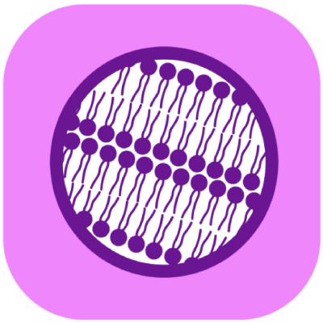

# Cimini Lab resources 

Below are ways to collaborate our lab, pointers to our software and its documentation, and the educational resources and papers we have been a part of. We hope these resources help you out!

This page last updated 2025-October-17

Jump to:

[About us](#about) | [Work with us](#collaborate) | [Software](#software) | [Educational materials](#educational) | [Papers](#papers)

## About us {#about}

[Lab website](https://cimini-lab.broadinstitute.org/)

[Lab members](https://cimini-lab.broadinstitute.org/people)

[Lab paper page](https://cimini-lab.broadinstitute.org/papers)

[Current lab preprints (from Beth's CV)](https://docs.google.com/document/d/1zZfoo2b-IbEDbpJ5pH6V0KlfdiY7A-clsAdRr-ouYX8/preview?rm=demo&tab=t.0#heading=h.ea9i2felg8yq)

[Beth's Broad bio page with contact email](https://www.broadinstitute.org/bios/beth-cimini)

[Beth's CV](https://docs.google.com/document/d/1zZfoo2b-IbEDbpJ5pH6V0KlfdiY7A-clsAdRr-ouYX8/preview?rm=demo&tab=t.0)

## Work with us {#collaborate}

[Learn about our collaboration models](https://cimini-lab.broadinstitute.org/collaboration)

[Image Analysis Collaboration: A Practical Guide](https://cimini-lab.broadinstitute.org/collaborator_guide)

[Office hours link (free for anyone! just show up!)](https://broad.io/imagingofficehours)

[CellProfiler annual support plan](https://cellprofiler.org/supportplan)

[Tool contributions you could make (from Google Summer of Code 2025 proposal)](https://ciminilab.github.io/GoogleSummerOfCode/)

[Attend our semi-annual bootcamp](https://cimini-lab.broadinstitute.org/bioimage-analysis-bootcamp)

## Software we make {#software}  

Jump to:

|  |  |  |  |  |
| [CellProfiler](#cellprofiler) | [CellProfiler Analyst](#cpa) | [Piximi](#piximi) | [Distributed Something](#ds) | [Bilayers](#bilayers) |

### CellProfiler {#cellprofiler}

Open source image analysis software.
Highly flexible workflow management tool with a robust plugin system.

| [Download CellProfiler](https://cellprofiler.org/releases) | [CellProfiler Manual](https://broad.io/CellProfilerManual) | [CellProfiler on GitHub](https://github.com/CellProfiler/CellProfiler)| [CellProfiler Plugins](https://plugins.cellprofiler.org/overview.html)| [CellProfiler Plugins on Github](https://github.com/CellProfiler/CellProfiler-plugins) |

#### Learn to Use CellProfiler

| [CellProfiler Tutorials](https://tutorials.cellprofiler.org/) | [CellProfiler Video Tutorials](https://www.youtube.com/playlist?list=PLXSm9cHbSZBBy7JkChB32_e3lURUcT3RL) | [CellProfiler Examples](https://cellprofiler.org/examples) | [CellProfiler Help Forum](https://forum.image.sc/tag/cellprofiler) | [CellProfiler pipeline suggester](https://www.boaq.org) |

#### Papers about CellProfiler

[CellProfiler-plugins, 2023](https://doi.org/10.1111/jmi.13223)\
[CellProfiler 4, 2021](https://doi.org/10.1186/s12859-021-04344-9)\
[CellProfiler 3, 2018](https://doi.org/10.1371/journal.pbio.2005970)\

### CellProfiler Analyst {#cpa}

Open source data exploration software.

| [Download CellProfiler Analyst](https://cellprofileranalyst.org/releases) | [CellProfiler Analyst Manual](https://cellprofileranalyst.org/manuals) | [CellProfiler Analyst on GitHub](https://github.com/CellProfiler/CellProfiler-Analyst)| [CellProfiler Analyst Help Forum](https://forum.image.sc/tag/cellprofiler-analyst) |

#### Papers about CellProfiler Analyst

[CellProfiler Analyst 3, 2021](https://doi.org/10.1093/bioinformatics/btab634)

### Piximi {#piximi}

Open-source, browser-based platform for interactive bioimage analysis.
User-friendly interface for annotation, segmentation, classification, and quantitative measurement of microscopy images.

| [Piximi.app](https://piximi.app/) | [Piximi Manual and Tutorials](https://documentation.piximi.app/) | [Piximi Video Tutorials](https://www.youtube.com/playlist?list=PLXSm9cHbSZBDe5KHQL3vGXq2-alBOj2Zh) | [Piximi on GitHub](https://github.com/piximi/piximi) | [Piximi Help Forum](https://forum.image.sc/tag/piximi) |

#### Papers about Piximi

[Preprint, 2024](https://doi.org/10.1101/2024.06.03.597232)

### Distributed-Something {#ds}

Run almost any encapsulated docker container in the Amazon Web Services infrastructure.

| [Distributed-Someting on Github](https://github.com/DistributedScience/Distributed-Something) | [Distributed-Something Documentation](https://distributedscience.github.io/Distributed-Something/introduction.html) |

#### Distributed Tools

| [Distributed-CellProfiler](https://github.com/DistributedScience/Distributed-CellProfiler) | [Distributed-Collate](https://github.com/DistributedScience/Distributed-Collate) | [Distributed-DeepProfiler](https://github.com/DistributedScience/Distributed-DeepProfiler) | [Distributed-Fiji](https://github.com/DistributedScience/Distributed-Fiji) | [Distributed-HelloWorld](https://github.com/DistributedScience/Distributed-HelloWorld) | [Distributed-OMEZarrCreator](https://github.com/DistributedScience/Distributed-OMEZarrCreator) |

#### Papers about Distributed-Something

[Distributed-Something: scripts to leverage AWS storage and computing for distributed workflows at scale, 2023](https://doi.org/10.1038/s41592-023-01918-8)

### Bilayers {#bilayers}

Open-source specification designed to characterize software containers in terms of expected inputs, outputs, and tunable parameters.
Its primary aim is to make bioimage analysis deep-learning algorithms more accessible by automatically generating intuitive, no-terminal-required user interfaces.

| [Bilayers documentation](https://bilayers.org/) | [Bilayers on GitHub](https://github.com/bilayer-containers/bilayers) | [Bilayers on Dockerhub](https://hub.docker.com/u/bilayer) | [Slide deck describing idea of Bilayers](https://zenodo.org/records/14751700) | [Bilayers video tutorial](https://youtu.be/X-7HTI1ZGUc) | [Old demo application of Bilayers](https://github.com/COBA-NIH/docker_gradio_demo) |

## Educational materials {#educational}

Jump to:

[Educational papers](#ed-papers) | [Things we lead](#ed-lead) | [Major contributors](#ed-major) | [Minor contributors](#ed-minor)

### Educational papers we wrote {#ed-papers}

[The Twenty Questions of Bioimage Object Analysis[2023]](https://doi.org/10.1038/s41592-023-01919-7) / [Tool implementation](https://www.boaq.org)

[A biologist’s guide to planning and performing quantitative bioimaging experiments[2023]](https://doi.org/10.1371/journal.pbio.3002167) 

[Creating and troubleshooting microscopy analysis workflows: Common challenges and common solutions[2024]](https://doi.org/10.1111/jmi.13288)

[A postdoctoral training program in bioimage analysis[2024]](https://doi.org/10.1091/mbc.E24-05-0214)

### Things we lead {#ed-lead}

[The Scientific Community Image Forum - Forum.image.sc](https://forum.image.sc/) / [**Paper** - Scientific Community Image Forum: A discussion forum for scientific image software[2019]](https://doi.org/10.1371/journal.pbio.3000340)

[Imaging Platform Blog](https://blog.cellprofiler.org)

[YouTube tutorials](https://www.youtube.com/channel/UC_id9sE-vu_i30Bd-skay7Q)

[Office hours link](https://broad.io/imagingofficehours)

[Ask Erin/Dear Beth image analysis tips video podcast](https://www.youtube.com/@AskErinDearBeth) / [Resources from podcast episodes](https://ciminilab.github.io/AskErin_DearBeth/)

[COBA website](https://openbioimageanalysis.org/)

Bioimaging Guide - [English](https://www.bioimagingguide.org/welcome.html) / [Spanish](https://es.bioimagingguide.org/) / [Portuguese](https://pt.bioimagingguide.org/) / [Czech](https://cs.bioimagingguide.org/) 

[The Image Based Profiling Handbook](https://cytomining.github.io/profiling-handbook/)

The Cell Painting Gallery (image repository) - [AWS RODA Website](https://registry.opendata.aws/cellpainting-gallery/) / [Explore on Quilt](https://open.quiltdata.com/b/cellpainting-gallery) /  [See featured on the National AI Ready Resource (NAIRR) Pilot website](https://nairrpilot.org/pilotresources) / [**Paper** - Cell Painting Gallery: an open resource for image-based profiling[2024]](https://doi.org/10.1038/s41592-024-02399-z)

[Bioimage Analysis Beginnings Broad Bootcamp (week-long paid course)](https://cimini-lab.broadinstitute.org/bioimage-analysis-bootcamp)

### Things we are major (but far from sole) contributors to {#ed-major}

Global Bioimage Analysts' Society (GloBIAS) Global Registries - [For bioimage analysts](https://www.globias.org/resources/bioimage-analyst-db) / [For bioimage analysis trainers](https://www.globias.org/resources/bia-trainers-db)

Virtual I2K Meeting - [2023 edition](https://2023.i2kconference.org/workshops) / [2024 edition](https://2024.i2kconference.org/virtual) / [2025 edition](https://www.i2kconference.org/virtual)

### Things we contributed to (but others led) {#ed-minor}

[Online guide for checklists for imaging and image analysis](https://quarep-limi.github.io/WG12_checklists_for_image_publishing/intro.html)  / [**Paper** -  Community-developed checklists for publishing images and image analysis [2023]](https://doi.org/10.1038/s41592-023-01987-9)

[Metrics Reloaded online metric chooser](https://metrics-reloaded.dkfz.de/) / [**Paper 1** - Metrics reloaded: recommendations for image analysis validation[2024]](https://doi.org/10.1038/s41592-023-02151-z) / [**Paper 2** - Understanding metric-related pitfalls in image analysis validation[2024]](https://doi.org/10.1038/s41592-023-02150-0)

[Microtutor imaging education platform](https://microtutor.globalbioimaging.org/)

Boston BioImage Analysis Society (BostonBIAS) - [sign up form](https://docs.google.com/forms/d/e/1FAIpQLScdHEtWUUm7bvzrw2hlYgkm6i5cfBZv_laHQFxfRQZ5MC5_vg/viewform)

[Cold Spring Harbor Quantitative Imaging Course (two-week paid course)](https://meetings.cshl.edu/courses.aspx?course=C-QICM)

## Papers you might find useful {#papers}

[Full list of lab papers and preprints](https://docs.google.com/document/d/1zZfoo2b-IbEDbpJ5pH6V0KlfdiY7A-clsAdRr-ouYX8/preview?rm=demo&tab=t.0#heading=h.z09a6qm8nrki)

Jump to:

[Profiling](#profiling) | [Tools and methods](#tools) | [Reviews](#reviews) | [Community Surveys](#surveys) | [Opinions/Perspectives](#opinions)

### Profiling protocols and methods {#profiling}

[Interpreting image-based profiles using Morpheus and single-cell visualization[2023]](https://doi.org/10.1002/cpz1.713)

[Optimizing the Cell Painting assay for image-based profiling[2023]](https://doi.org/10.1038/s41596-023-00840-9)

[A genome-wide atlas of human cell morphology[2024]](https://doi.org/10.1038/s41592-024-02537-7)

[Live-cell painting: Image-based profiling in live cells using acridine orange[2025]](https://doi.org/10.1091/mbc.E24-07-0308)

[Alternate dyes for image-based profiling assays[2025]](https://doi.org/10.1016/j.slasd.2025.100268)

### Computational tools and methods {#tools}

[ImageJ and CellProfiler: Complements in Open-Source Bioimage Analysis[2020]](https://doi.org/10.1002/cpz1.89)

[Reproducible image-based profiling with Pycytominer[2025]](https://doi.org/10.1038/s41592-025-02611-8)

[CellPhePy: A python implementation of the CellPhe toolkit for automated cell phenotyping from microscopy time-lapse videos[2025]](https://doi.org/10.1111/jmi.13416)

### Reviews {#reviews}

[Open-source deep-learning software for bioimage segmentation[2021]](https://doi.org/10.1091/mbc.E20-10-0660)

[Defining the boundaries: challenges and advances in identifying cells in microscopy images[2024]](https://doi.org/10.1016/j.copbio.2023.103055)

### Community Surveys {#surveys}

[2020 BioImage Analysis Survey: Community experiences and needs for the future[2021]](https://doi.org/10.1017/S2633903X21000039)

[Bridging Imaging Users to Imaging Analysis - A community survey[2023]](https://doi.org/10.1111/jmi.13229)

2024 survey results - [forum post](https://forum.image.sc/t/2024-bridging-imaging-users-to-image-analysis-survey/116530) / [repository](https://github.com/COBA-NIH/2024_Bridging_Imaging_Users_to_Imaging_Analysis_Survey) 

### Opinions/Perspectives {#opinions}

[Moving beyond the desktop: Prospects for Practical Bioimage Analysis via the Web[2023]](https://doi.org/10.3389/fbinf.2023.1233748)

[Building momentum through networks: Bioimaging across the Americas[2024]](https://doi.org/10.1111/jmi.13318)

[The Crucial Role of BioImage Analysts in Scientific Research and Publication[2024]](https://doi.org/10.1242/jcs.262322)

[A Call for FAIR and Open-Access Training Materials to advance Bioimage Analysis (preprint)[2024]](https://doi.org/10.31219/osf.io/2zgmc)

[Harmonizing the Generation and Pre-publication Stewardship of FAIR Image Data (preprint)[2024]](https://doi.org/10.48550/arXiv.2401.13022)

[Enabling Global Image Data Sharing in the Life Sciences [2025]](https://doi.org/10.1038/s41592-024-02585-z)
